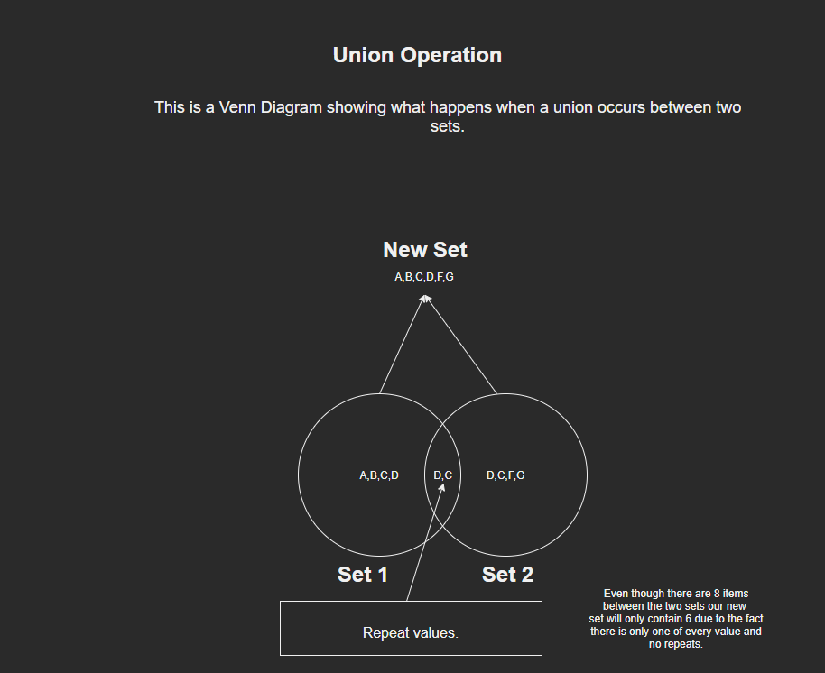

# Set - Data Structure Python 

# What is a set?
A set is a very useful data structure it is linear just like a stack. The only difference is that it is unordered and unindexed. Which means we can't be to sure 
what order our items in the set will be in. Once the item is in the set it is **unchangeable** and **sets do not allow duplicate values**. We also cannot reference items in a set by index or key.

# What kind of problems can a set solve?
Many problems benefit from the use of a set. It is very useful for when trying to sort out a certain thing from a list. Many times we do not want duplicates in a list so we can use a set to ensure that. They are also great for unions and intersections combining both sets. It is a very useful data structure to use in many algorithims. 

# Operations of a set

# Operation - add
The add operation will add items to the set.
```python
set_1 = set() # This is how to initialize a set. In other examples we will show other ways.

set_1.add(1)
set_1.add(2)
set_1.add(4)

# The set will now contain {1,2,4}
```

# Operation - union
A union will take two sets and combine them. Remeber there will be **no duplicate values** in the new set.
```python
A = {0, 2, 4, 6, 8}
B = {1, 2, 3, 4, 5}
new_set = A.union(B)

# new_set will now contain -> {0, 1, 2, 3, 4, 5, 6, 8}
```

# Operation - Intersection
An intersection will create a new set where only values that are in both sets will be added into the new set.
```python
A = {0, 2, 4, 6, 8}
B = {1, 2, 3, 4, 5}
new_set = A.intersection(B)

# new_set will now contain -> {2, 4}
```
# Operation - Difference
The difference operation will create a new set where unique values from each set will be present. Be aware it will only add to the set unique values from A not B.
For example if B had an extra 9 it would not be added to the new_set variable. As it is comparing A to B anything not in B that A has will be added to the new set.
Although if we would want the difference values from B we would just switch the A and B below for example: `new_set = B.difference(A)`. This would give us a completely different output set. **There will be a table below explaining this.**
```python
A = {0, 2, 4, 6, 8, 7}
B = {1, 2, 3, 4, 5}
new_set = A.difference(B)

# new_set will now contain -> {0,8,6,7}
```

# Operation - Clear
Clear will remove all items from a set.
```python
A = {0, 2, 4, 6, 8, 7}
B = {1, 2, 3, 4, 5}
new_set = A.difference(B)

new_set.clear()
# new_set will now contain -> {} and will output to the console set()
```

# Example problems
Lets do a few example problems.
Imagine we want to find out who attended both parties with a guest list.
```python
party_1 = {"Annie","Richie","Rosie","Becca","Ryland","Scott"}
party_2 = {"Annie","Richie","Rosie","Becca","Samantha","Mom","Dad",}

guest_list = party_1.intersection(party_2)
print(guest_list)
# Click the link below to go to the file to run the progam to see the output.
```
[Example_1](example_1.py)

This next example problem we want a combined guest list from both parties.

```python
party_1 = {"Annie","Richie","Rosie","Becca","Ryland","Scott"}
party_2 = {"Annie","Richie","Rosie","Becca","Samantha","Mom","Dad",}

cumulative_guest_list = party_1.union(party_2)
print(cumulative_guest_list)
```
[Example_2](example_2.py)


# Prove Problems
Tell me who was at party_1 but not at party_2. Then create a new set containing
the people who didnt go to party_2 and the people who didn't go to party_1. Then
output the set to know who only attended one party not both.

[Single_party_goers_problem](problem_1.py)

[Single_party_goers_problem_solution](problem_1_solution.py)

# Difference Table understanding

Difference Set values |     |    |          |      
-------- | -------- | -------- | -------- |
Set_1 | 12 | 16 | 18 | 
Set_2 | 10 | 16 | 18 | 

Consider if we want to know what numbers are in set_1 and not set_2 would write the following code: 

`new_set = set_1.difference(set_2)`

The new_set would contain the following number -> 12

If we want to know which numbers are in set_2 and not set_1 we would write similar code. Pay attention to the format. consider the following code:

`new_set = set_2.difference(set_1)`

The new_set would contain the following number -> 10

So, when using the difference operation consider which differences you want.

# Venn Diagram of a set when a Union Occurs. 
Click on the link to see the example diagram. 


