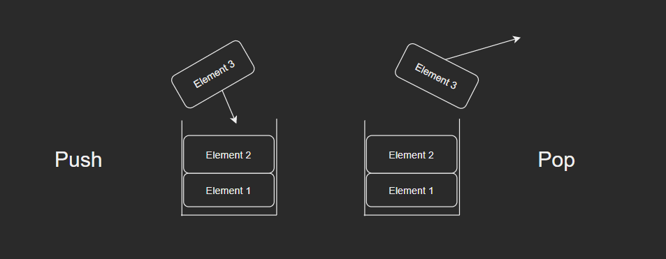

# Stack - Python

# What is a Stack?

A stack works well due to the fact they are easily arrangeable like a stack of plates. We can use it for many purposes even in the first in last out idealogoy of stacks. We simply push to the stack and then we can pop from the stack. It is a great data type when we want to back track.
The other great thing about a stack it can hold many different data types.

# How Do I use a stack to solve a Problem?

Stacks are very useful for almost any problem in python. They are one of the best resources for parsing through data. Also, they are a great data structure for backtracking algorithims. 

# How efficient are Stacks? 
Stacks are a very efficient data structure. Stacks are O(1) efficiency as we always push or pop them. 

# Examples
Stack Examples

This is a simple example of a stack and how to use it push to it and pop from it.

```python
class Stack:
     def __init__(self):
         self.stack_items = []

     def isEmpty(self):
         return self.stack_items == []

     def push(self, item):
         self.stack_items.append(item)

     def pop(self):
         return self.stack_items.pop()

     def size(self):
         return len(self.stack_items)
stack = Stack()
stack.push(3)
stack.push(4)
stack.pop()
# If we printed the new stack the output wold be [3]
```
To see this example in a python file click the link below:

[Example_stack](Stack_example_1.py)


# Practice Problems 
Say I want to see who the last person to come inside a building was. Each time someone enters the building we add them to the stack. We have had a robbery though and I want a new stack with the last person who came in last to the building.
Here is the problem below:
```python
class Stack:
     def __init__(self):
         self.stack_items = []

     def isEmpty(self):
         return self.stack_items == []

     def push(self, item):
         self.stack_items.append(item)

     def pop(self):
         return self.stack_items.pop()

     def size(self):
         return len(self.stack_items)

# Okay our stack is all setup. 

# Problem below:

stack = Stack()
stack.push("Annie Roberts") # Entered 1st
stack.push("Ruth Rodriguez") # Entered 2nd
stack.push("Richard Roberts") # Entered 3rd

# Tell me who was the last person in the building using a stack operation (e.g. size, isEmpty, etc.)

```
[Problem_1](Stack_problem_1.py)

[Problem_1_Solution](Stack_problem_1_solution.py)


# List of operations: 
Here in this section we will go over each operations used by a stack.

# Operation - Push 
Push is when we push and item to the stack in python.
We will use the append function. 
```python
stack = []
stack.push(2)
stack.push(4)
# Stack if you printed it [2,4]

```

# Operation - Pop
Pop removes the last item pushed to a stack. 
```python
# Will remove last item in Stack.
stack = [1,2,3,4,3]
stack.pop()
# This will be the stack if we printed it -> [1, 2, 3, 4]
```

# Operation - isEmpty
This operation will return true or false and whether or not the stack is empty.
Example below:
```python

stack = []
stack.isEmpty() #-> True 

stack = [1]
stack.isEmpty #-> False

```

# Operation - size 
The size operation will return the size of your stack
Example below:
```python
stack = [1,2,3,4]
size_of_stack = stack.size()
print(size_of_stack)
# This would print out -> 4
```
# Table of how Push and Pop work.
This table will show how a stack looks after we push to it and what would be the first out if we used the pop operation. This shows the first in last out method. Explaining the first thing we pushed stays and the last thing we pushed is the thing first removed from the list.

Push | Stack | Pop
-------- | -------- | --------
11 | 11 | 13
12 | 12 | 12
13 | 13 | 11

# Diagram of push and pop.




