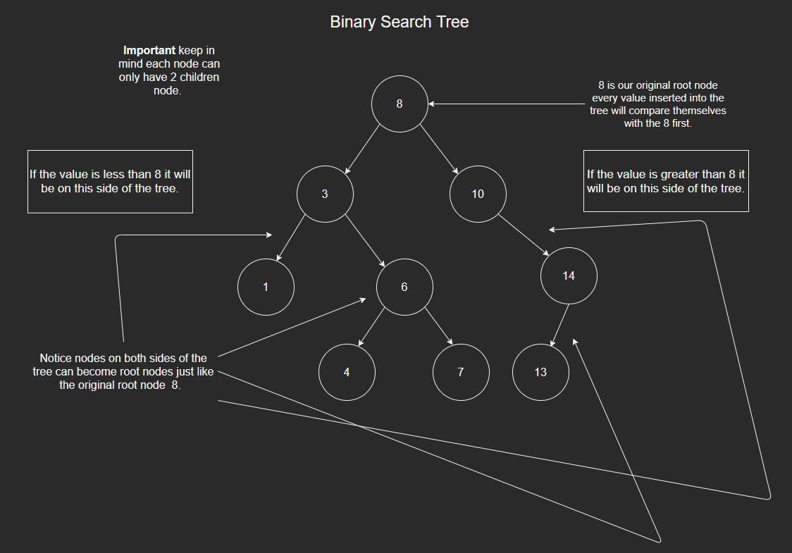

# Binary Search Tree 
A Binary Search Tree is a data structure in Python we use nodes to populate it. 
It is a very useful data structure to be able to cut down on search times of certain values. 
Binary Search Trees also offer a great way to organize nodes.

# Binary Search Tree - How does it work? 
So a Binary Search tree has a root node. If the value we are adding to the tree is less than the root node it will be on the left side. Then it will compare itself to the next node on the left side of the tree. If the value is greater then the node on the left side of the tree then it will be on the right side of that node. If it is less it will be on the left side of it. If the value we are adding to the tree is greater than the root node it will be on the right side. It will compare just like it did before if it is greater it will be on the right if it less it will be on the left. A diagram will be below.



# Binary Search Tree - Operations
Below we will discuss the operation of a Binary Search Tree.

# How do BST operations work? 
Operations in Binary Search Trees almost always use Recursion. Recursion is when a function continues to call itself and repeat its operations until some condition specified is met.
For example below consider the insert function code below. 
```python
    def insert(self,data):
        if self.root is None:
            self.root = Tree.Node(data)
        else:
            self._insert(data, self.root)  # Start at the root

    def _insert(self,data,node):
        if data == node.data:
            return 
        if data < node.data:
            if node.left is None:
                node.left = Tree.Node(data)
            else: # This line below is an example of recursion.
                self._insert(data, node.left) # If we do not find a place to insert at. Repeat the function but now passing in the node to the left. 
        else:
            if node.right is None:
                node.right = Tree.Node(data)
            else:   # This line below is an example of recursion.
                self._insert(data, node.right) # If we do not find a place to insert at. Repeat the function but now pass in the node to the right. 
```

# Operation - Insert
Insert will insert our node into the correct position of our BST (Binary search Tree). Based on its value it will be inserted into the tree.  
```python
tree_bst = Tree()
tree_bst.insert(7)
tree_bst.insert(9)

# Our tree will now contain the 7 and 9. With 7 being the root node and 9 will be a child node on the right side of it. 
```

# Operation - Search
The search operation will search for a node and once it is found it will print to the console "node is found." If the node is not found it will say "Element not found." A simple example will be below.
```python
tree_bst.search(6)
# If 6 is in the tree it will return True
# If 6 is not present in the tree return False.
```
# Operation Traverse - Forward or reverse.
Traverse reverse will loop through the tree from largest values to smallest. The other way to traverse through is forward which if the smallest values to largest.
```python
tree = Tree()
tree.insert(10)
tree.insert(12)
tree.insert(9)

for x in tree:
    print(x)
    # This is what it would print out -> 9 , 10 , 12

for x in reversed(tree):
    print(x)
    # This is what it would print out -> 12, 10 , 9

```
# Operation - Height 
The height function will tell you how tall the tree is. See the table below to understand.
```python
tree = Tree()
tree.insert(10)
tree.insert(12)
tree.insert(9)
tree.get_height()
```
# How height works - Table
We need to understand each time we insert a node it does not increase the height.
It only increase when a new child node starts a new level for example below. Once 12 is 
inserted to the tree the height becomes 2. Due to the fact 12 becomes a child node of 10. Even though we insert 9 it is still a child node of 10 meaning the height is still 2. If either 9 or 12 gain a child node the height will become 3. 

root node | left side | right side | height
-------- | -------- | --------       |----------   
10 | None | None       |   1
10 | None | 12         |2
10 | 9    | 12         | 2


# Example Tree


```python
class Tree:

    class Node:
        def __init__(self,data): 
            self.data = data
            self.left = None   
            self.right = None
    def __init__(self):
        self.root = None

    def insert(self,data):
        if self.root is None:
            self.root = Tree.Node(data)
        else:
            self._insert(data, self.root)  # Start at the root

    def _insert(self,data,node):
        if data == node.data:
            return 
        if data < node.data:
            if node.left is None:
                node.left = Tree.Node(data)
            else:
                self._insert(data, node.left)
        else:
            if node.right is None:
                node.right = Tree.Node(data)
            else:
                self._insert(data, node.right)
                
    def search(self, data):
        return self._contains(data, self.root)  

    def _contains(self, data, node):
        if data == node.data:
            return True
        else:
            if data < node.data:
                if node.left is None:
                    return False
                elif node.left is not None:    
                    return self._contains(data,node.left)
            if data > node.data:
                if node.right is None:
                    return False
                elif node.left is not None: 
                    return self._contains(data,node.right)
        return False

    def __iter__(self):
        yield from self._traverse_forward(self.root)  # Start at the root        
    def _traverse_forward(self, node):
        if node is not None:
            yield from self._traverse_forward(node.left)
            yield node.data
            yield from self._traverse_forward(node.right)

    def __reversed__(self):        
        yield from self._traverse_backward(self.root)  # Start at the root
    def _traverse_backward(self, node):
        if node is not None:
            yield from self._traverse_backward(node.right)
            yield node.data
            yield from self._traverse_backward(node.left)

    def get_height(self):
        if self.root is None:
            return 0
        else:
            return self._get_height(self.root)  # Start at the root
    def _get_height(self, node):        
        if node == None:
            return 0 
        else:
            return  1 + max(self._get_height(node.left),self._get_height(node.right))
# Code that runs the tree
tree_BST = Tree()
tree_BST.insert(3)
tree_BST.insert(4)
tree_BST.insert(1)
print("This is the height: ",tree_BST.get_height())
print(" ")
for x in tree_BST:
    print("Smallest to Largest: ",x)
print("  ")
for x in reversed(tree_BST):
    print("Largest to Smallest: ",x)
print(" ")
print("Is 4 in the Tree? T/F: ",tree_BST.search(4))
print("Is 5 in the Tree? T/F: ",tree_BST.search(5))
print(" ")
```
To see this code and run it click the file below.

[Example Tree](example_BST.py)

# Prove Problem
There will be a tree provided to you with a height of 4. After you create a tree with the height of 4 traverse through it from smallest to largest. 

[Binary search tree height problem](height_problem.py)

[Binary Search tree height solution](height_problem_solution.py)